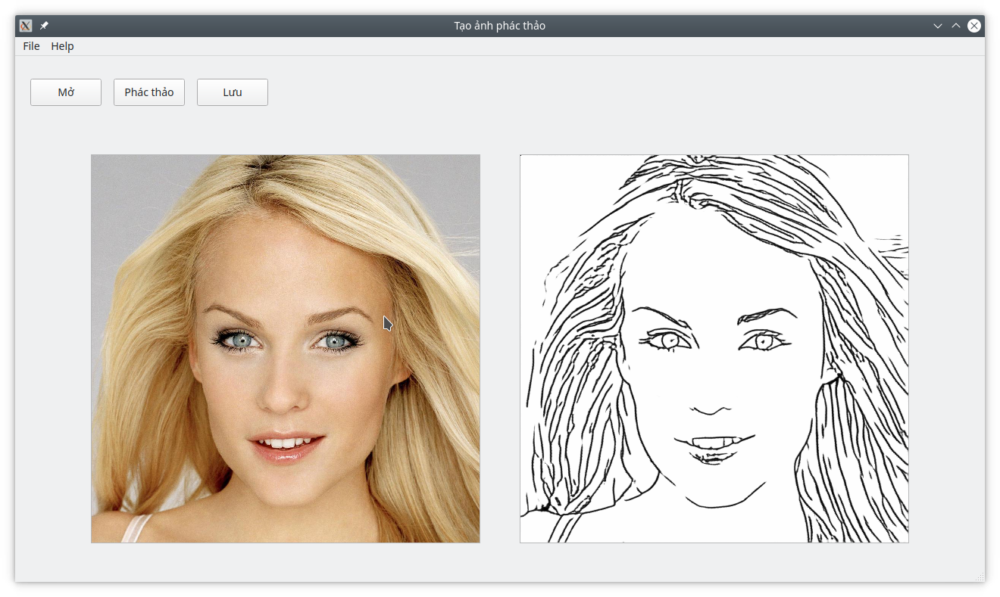

# SketchGen (Ứng dụng chuyển đổi ảnh khuôn mặt thành nét phác thảo đơn giản)

## Đồ án tốt nghiệp chuyên ngành khoa học máy tính

### Tên đề tài: TÁI TẠO HÌNH ẢNH KHUÔN MẶT NGƯỜI TỪ NÉT PHÁC THẢO

### Giáo viên hướng dẫn: PGS.TS Lê Hoàng Thái

### Thời gian thực hiện: 6 tháng

### Sinh viên thực hiện:

| Tên | MSSV | Mail |
| ------------ | ------------- | ------------- |
| Vũ Trọng Đạt | 1712338 | 1712338@student.hcmus.edu.vn |
| Nguyễn Hoàng Chiến | 1712301 | 1712301@student.hcmus.edu.vn |
| Nguyễn Phục Dược | 1712372 | 1712372@student.hcmus.edu.vn |
| Nguyễn Trường An | 1712262 | 1712262@student.hcmus.edu.vn |
| Nguyễn Ngọc Chung Chí | 1712300 | 1712300@student.hcmus.edu.vn |

### Loạt đề tài: Tìm hiểu lý thuyết  - Nghiên cứu công nghệ và xây dựng ứng dụng

## Tổng quan
Ứng dụng này cho phép người dùng chuyển một ảnh bất kỳ sang ảnh phác thảo đơn giản hoá.


## Yêu cầu

1. Phần cứng

-   Ubuntu 18.04 hoặc mới hơn

-   NVIDIA GPU + CUDA 9.2 (tuỳ chọn)

2. Phần mềm

-   Python 3.7
-   torch==0.4.1.post2 
-   torchvision==0.2.1 
-   PyQt5==5.12
-   ImageMagick

```
sudo python3 -m pip install torch==0.4.1.post2 torchvision==0.2.1 PyQt5==5.12

sudo apt install imagemagick
```

-   Cài đặt

Kích hoạt môi trường PyThon ảo và gõ câu lệnh sau:

```
sh setup_env.sh
```

## Hướng dẫn sử dụng
Trước khi mở ứng dụng, chạy câu lệnh sau để tải weight:

```
sh download_models.sh
```

Sau khi tải xong, chạy câu lệnh sau để sử dụng phiên bản CPU:

```
python3.7 SketchGen_cpu.py
```

Hoặc chạy câu lệnh sau để sử dụng phiên bản GPU:

```
python3.7 SketchGen.py
```
